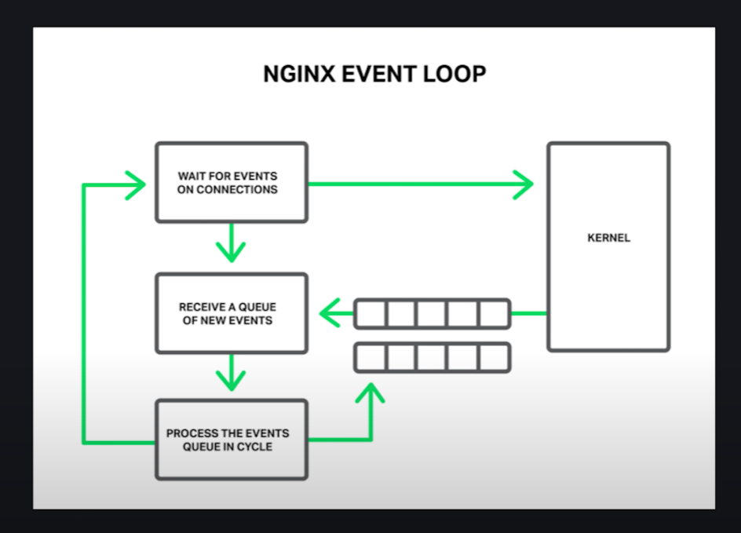

# DevOps

## Introduction

Termes abordes :

- dev: dev logiciel
- ops: toute autre operation IT
- temps de livraison
- collaboration
- automatisation
- livraison continue (methode Agile)

Le terme devOps designe couramment un ensemble de pratiques,
qui combinent le developpement logiciel (Dev) et d'autres pratiques IT (Ops), le devOps a pour but de reduire le temps
de livraison des logiciels et de divers services informatiques.

Ces pratiques privilegient la collaboration, l'automatisation des taches et la livraison en continu. Ces pratiques sont aujourd'hui au coeur des pratiques modernes de developpement logiciel.

## Les methodes agiles

Les termes a retenir :

- gestion de projet IT
- implication du client
- reactivite aux demandes client
- satisafaction du client
- Manifeste agile https://manifesteagile.fr/

## L'integration continue

Les termes a retenir:

-

Exemple 1 : Ca fonctionne sur mon pc!

- Push du code fonctionnel localement
- fichiers de config et variable d'env dependants de votre poste de travail

-> L'equipe de travail est regulierement 'bloquee' a chaque ajout de code.

L'integration continue :
Une pratique de developpement logiciel ou les membres d'une equipe integrent leur travail le plus
frequemment possible, habituellement chacun au moins une fois par jour (pour entrainer plus d'integration par jour). Chaque integration sera validee par un build automatique (qui inclut des tests) pour detecter les erreurs d'integration aussi vite que possible.

L'integration continue se base sur les principes suivants:

- `build often`
- `test often`
- `integrate often`

Voici les bonnes pratiques a mettre en place tout au long de la semaine :

- Maintenir un depot de code source versionne (Git)
- Automatiser les etapes de build\*
- Chaque etape de build entraine une serie de test
- tous les membres de l'equipe commit aussi souvent que possible
- Le systeme de gestion des branches (Git) doit etre adapte au processus d'ajout des features...
- Tout commit doit amener a la creation ou l'utilisation d'une branche d'integration
- Reduire le temps de build au maximum
- Tester le produit dans un environnement de prod duplique
- Rendre disponible facilement le dernier build
- Tous les acteurs du projet doivent avoir un acces facilite au processus d'IC
- Automatiser le deploiement
- Fournir un moyen de visualisation et/ou de reporting de chacune des etaps pour un meilleur suivi

L'objectif de ces pratiques est de s'assurer que chaque modificatio du code source n'entraine pas de regression.

## Les tests

### Les tests unitaires

Les tests unitaires sont des tests automatisés qui permettent de vérifier le bon fonctionnement d'une partie isolée du code, appelée unité. Les unités peuvent être des fonctions, des méthodes ou des classes. Les tests unitaires sont généralement écrits par les développeurs eux-mêmes et sont exécutés à chaque fois que le code est modifié. L'objectif des tests unitaires est de détecter les erreurs de logique et les bugs dès que possible, afin de les corriger rapidement.

Pour cela nous avons besoin d'une bibliotheques de test pour React JS telle que Jest ou encore Enzyme. Pour installer enzyme :

```bash
npm install --save-dev enzyme
```

Ensuite vous aurez besoin de fichier de test (ex: fichier.test.js) qui contiendra alors une ou plusieurs fonctions a tester. `it` permet de definir un test individuel et `describe` permet de regrouper plusieurs tests ensemble.

Configurer le test : Pour configurer le test, vous pouvez définir les props que vous souhaitez passer à votre composant React et utiliser la méthode mount d'Enzyme pour simuler le rendu du composant.

Exécuter le test : Pour exécuter le test, vous pouvez utiliser la commande npm test. Jest exécutera tous les tests dans votre dossier de test et affichera les résultats dans votre terminal.

```javascript
import React from "react";
import { mount } from "enzyme";
import MyComponent from "./MyComponent";

describe("MyComponent", () => {
  it("renders the component", () => {
    const wrapper = mount(<MyComponent title="My Component" />);
    expect(wrapper.find("h1").text()).toEqual("My Component");
  });
});
```

Dans cet exemple, nous testons si le composant MyComponent est correctement rendu avec le titre "My Component". Nous utilisons la méthode mount d'Enzyme pour simuler le rendu du composant et la méthode expect de Jest pour vérifier si le titre est correctement affiché.

### Les test d'integration

Les tests d'intégration sont des tests qui vérifient le bon fonctionnement de plusieurs unités de code ensemble, dans un environnement simulé. Ces tests sont généralement écrits par les développeurs et sont exécutés avant que le code ne soit déployé. L'objectif des tests d'intégration est de s'assurer que les différentes parties du code fonctionnent bien ensemble et qu'il n'y a pas de conflits.

### Les tests E2E (End-to-End)

Les tests E2E (End-to-End) sont des tests qui vérifient le bon fonctionnement de l'application dans son ensemble, de bout en bout. Ils simulent les interactions d'un utilisateur avec l'application, en vérifiant que toutes les fonctionnalités de l'application fonctionnent correctement. Les tests E2E sont généralement écrits par des testeurs ou des automates de test, et sont exécutés avant ou après le déploiement de l'application. L'objectif des tests E2E est de s'assurer que l'application répond aux exigences et aux attentes de l'utilisateur final.

## Les differents types de build

### Le build du developpeur / prive / local

- Lance manuellement aussi souvent que possible (plus d'une dizaine par jour est un minimum...)
- Teste les changements apportes par un developpeur

### Le build de ci:

- Lancement journalier
- Automatique
- Tester en routine les changements apportes par tous les developpeurs d'une equipe

### Les builds 'overnight' ou nightly:

- Lancement journalier par l'outil de CI
- Test afin de verifier l'etat de la prod, les perf, build d'integration le plus complet possible.

### En resume :

- build de jour: compilation + test unitaires
- build de nuit: compilation + toutes les categories de test abrodes precedemment + deploiement

## Quelques bibliotheques de tests pour React

- Jest (meilleur choix pour React)
- Mocha (bon support navigateur)
- Chai
- Jasmine
- Karma
- Cypress (e2e base sur mocha)

## Un peu de vocabulaire:

- describe('string', ()=> {}): decrit un test et contient un/des test(s) au sein d'un callback

- test('ce qu\'on teste', () => { logique de test }) : permet de declarer un test

- expect() : permet de faire une assertion

- assertion: proposition booleene qui tente de predire un resultat de fonction par exemple

- it: permet de declarer un test

- matcher: fonction qui permet de realiser une assertion ex: toEqual()

### NGINX

NGINX se comporte comme une gateway qui se positionne entre internet et votre backend, quand vous visitez une webapp le premier endroit que vous tentez d'atteindre est un serveur web. Le travail du serveur web est de traiter la ressource demandee par le client:

- la trouver sur le serveur
- la retourner en tant que reponse

Si vous analysez les headers de beaucoup de reponses http sur le web il y a de grandes chances pour le server soit nginx, cette technologie est extrenment populaire avec des sites a haut traffic. En effet, nginx peut gerer plus de 10 000 connexions entrantes simultanees,



Nginx peut donc faire office de serveur web mais est aussi communement utilise en tant que reverse proxy, sert de point de controle afin de distribuer la charge entrante vers differents serveurs backend et fournit un certain niveau niveau de securite et de caching (afin d'ameliorer les performances)

Dans la plupart des cas nginx est installe sur un serveur linux, avec un configuration situee :

```bash
/etc/nginx/nginx.conf
```

On peut customiser la configuration nginx en definissant des directives :

```conf
user nobody;
error_log /var/log/nginx/error.log; // contexte global ou principal

http {
  ## contexte http
}

```

Une directive represente tout simplement une paire cle/valeur, si vous rencontrez une cle suivie d'accolades on parle alors de contexte. Les contextes servent a

L'un des roles principal de nginx est de servir du contenu statique, on peut configurer cela dans le contexte http, dans lequel nous pouvons definir un ou plusieurs serveurs. Chacun de ces serveurs se distingue des autres par le port sur lequel il sera capable d'ecouter. Nginx sera capable d'analyser les requetes serveur entrantes et de les rediriger vers le bon chemin. L'activite generee par le traffic entrant sera loggee au sein du fichier de log correspondant.

```conf
user nobody;
error_log /var/log/nginx/error.log; // contexte global ou principal

http {
  ## contexte http
  server {
    listen 80;
    access_log /var/log/nginx/access.log;
  }
}

```

L'un des parametres les plus imporants de nginx est definir le repertoir racine, ou se trouve les fichiers statiques a servir.

```conf
user nobody;
error_log /var/log/nginx/error.log; // contexte global ou principal

http {
  ## contexte http
  server {
    listen 80;
    access_log /var/log/nginx/access.log;

    location / {
      root /app/www;
    }
  }
}

```

Si un utilisateur navigue alors sur notre domaine, le serveur sera capable de renvoyer le contenu html dans le repertoire `/app/www`

On peut aussi decider de choisir une seconde "location" en definissant une regex pour recuperer tout type d'image au niveau du repertoire contenant les images de notre site web.

```conf
user nobody;
error_log /var/log/nginx/error.log; // contexte global ou principal

http {
  ## contexte http
  server {
    listen 80;
    access_log /var/log/nginx/access.log;

    location / {
      root /app/www;
    }

    location ~ \.(gif|jpg|png)$ {
      root /app/images;
    }
  }
}

```

Reverse proxy : si on remplace root avec proxy pass on peut pointer sur un serveur completement different sur internet

```conf
http {
  server {
    listen 80;
    access_log /var/log/nginx/access.log;

    location / {
     #  root /app/www;
     proxy_pass http://localhost:5000;

    }
  }
}

  server {
    listen 5000;
    root /app/www;

    location / {

    }
  }

```
